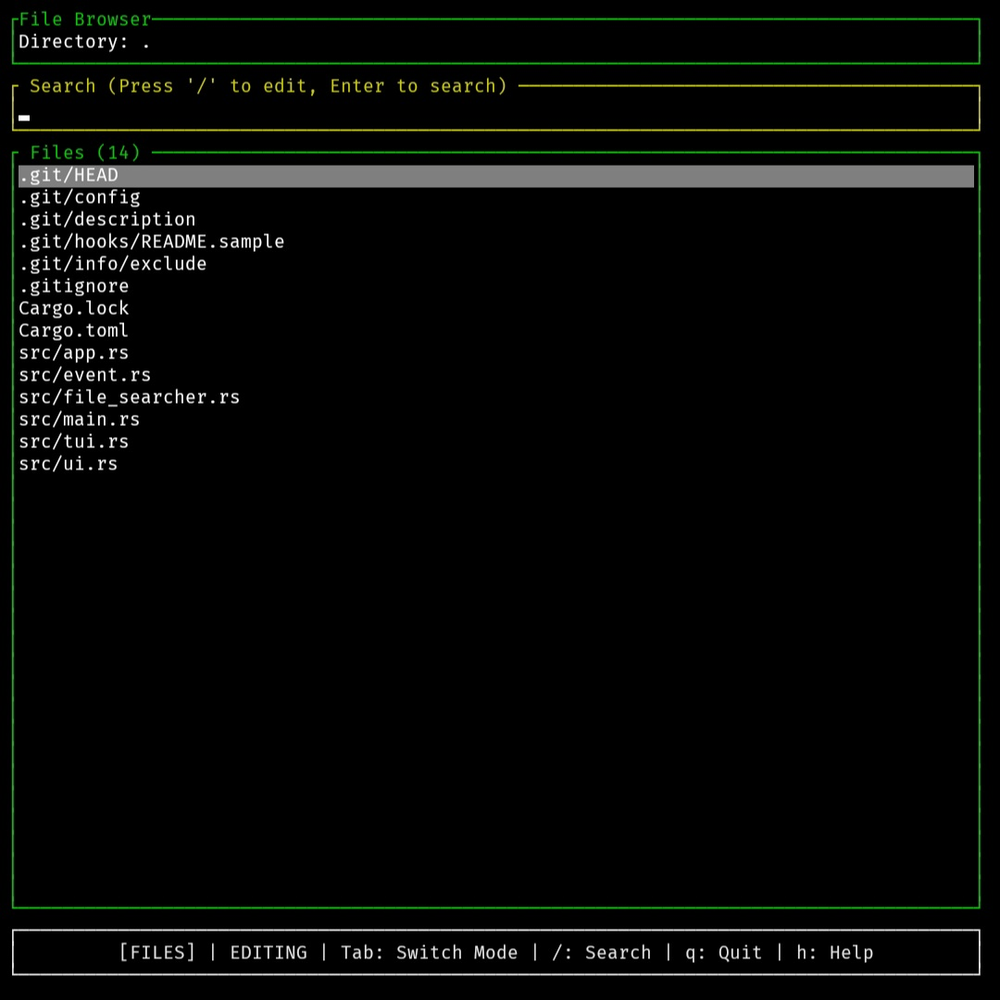
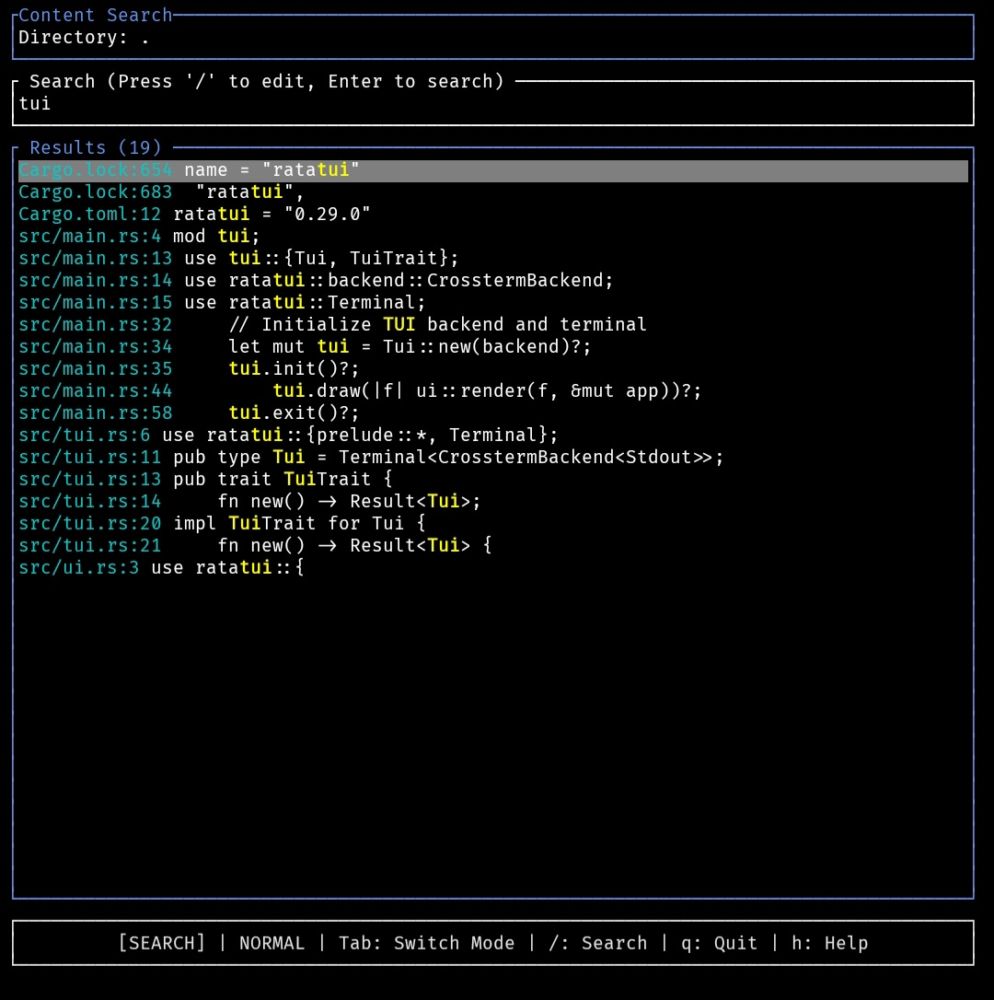
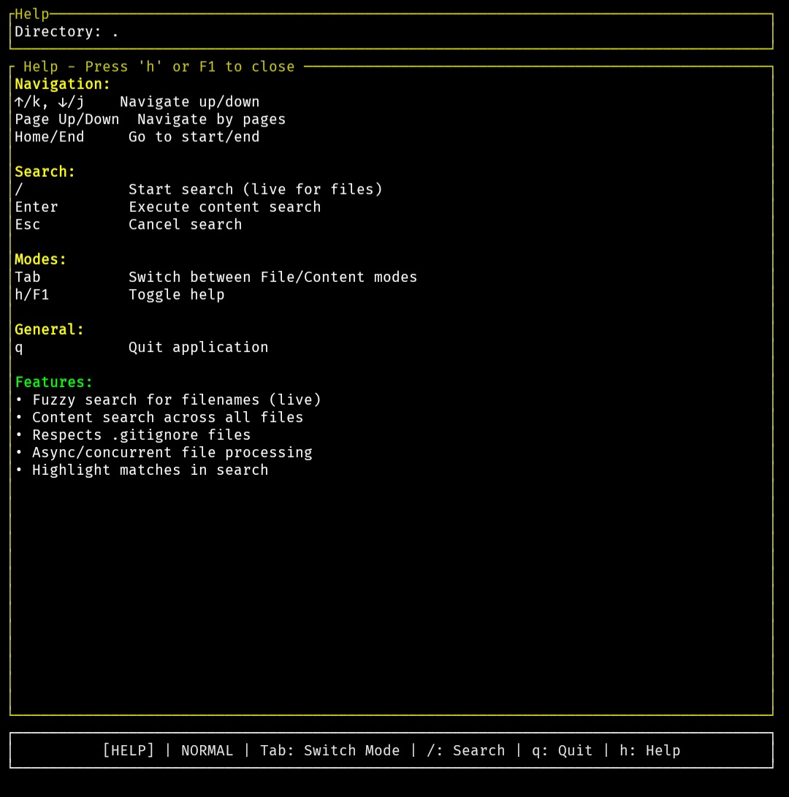

# Ratsnest

A fast, terminal-based file search and content exploration tool built with Rust and Ratatui.

## Features

- **Fuzzy file search**: Live fuzzy matching for filenames as you type
- **Content search**: Search text within files across your entire project
- **Git awareness**: Respects .gitignore files and git repositories
- **Async performance**: Concurrent file processing for fast searches
- **Syntax highlighting**: Match highlighting in search results
- **Keyboard navigation**: Vim-style navigation (hjkl) and standard arrow keys

## Screenshots

### File Browser


### Content Search


### Help Screen


## Installation

### From Source

```bash
git clone https://github.com/Cod-e-Codes/ratsnest.git
cd ratsnest
cargo build --release
```

The binary will be available at `target/release/ratsnest`.

## Usage

```bash
# Search in current directory
ratsnest

# Search in specific directory
ratsnest -d /path/to/directory

# Start with initial search pattern
ratsnest -d /path/to/directory -p "pattern"
```

### Options

- `-d, --directory <PATH>`: Directory to search (default: current directory)
- `-p, --pattern <PATTERN>`: Initial search pattern

## Key Bindings

### Navigation
- `↑/k`, `↓/j`: Navigate up/down
- `Page Up/Down`: Navigate by pages
- `Home/End`: Go to start/end of list
- `Tab`: Switch between File Browser and Content Search modes
- `n/]`: Next page
- `p/[`: Previous page
- `Ctrl+g`: First page
- `G`: Last page

### Search
- `/`: Start search input (live search in File Browser mode)
- `Enter`: Execute search (required for Content Search mode)
- `Esc`: Cancel search input

### General
- `h/F1`: Toggle help screen
- `q`: Quit application

## Modes

### File Browser Mode
- Lists all files in the directory
- Live fuzzy search as you type
- Respects gitignore patterns
- **Pagination**: Browse files in pages when directory contains many files

### Content Search Mode
- Search for text within files
- Shows filename, line number, and context
- Highlights matches in results
- **Pagination**: Browse search results in pages for large datasets

## Requirements

- Rust 1.70 or later

## Dependencies

- `anyhow`: Error handling
- `clap`: Command-line argument parsing
- `crossterm`: Terminal control
- `fuzzy-matcher`: Fuzzy string matching
- `ignore`: Git-aware file walking
- `ratatui`: Terminal UI framework
- `tokio`: Async runtime

## License

This project is licensed under the MIT License.

## Contributing

Contributions are welcome. Please ensure all tests pass and follow the existing code style before submitting a pull request.
